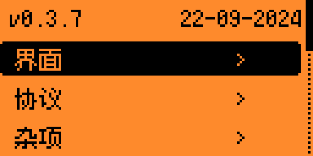
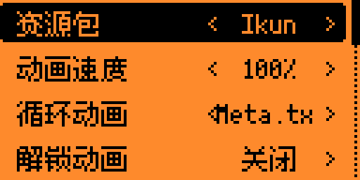
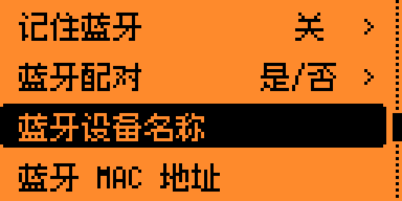

<p align="center">
  
  <h2 align="center">用于 Flipper Zero</h2>
</p>

<h2 align="center">
  <a href="#%E5%AE%89%E8%A3%85%E6%96%B9%E6%B3%95">安装</a> | <a href="#%E5%8F%98%E6%9B%B4%E5%88%97%E8%A1%A8">功能</a> | <a href="https://discord.gg/momentum">Discord</a>
</h2>

本项目基于`Momentum-Firmware`，添加个人所需的定制化需求。

- Momentum-Firmware

该自定义固件基于[官方固件](https://github.com/flipperdevices/flipperzero-firmware)开发，并包括了[Unleashed](https://github.com/DarkFlippers/unleashed-firmware)的许多强大功能。它是 Xtreme 固件的直接延续，由同一开发团队打造。

-----
<br>
<h2 align="center">操作模式：</h2>

该固件的目标是不断突破 Flipper Zero 的可能性，推动许多新颖功能的创新，同时保持最简单和最可自定义的用户体验。及时修复错误，确保系统的稳定性和兼容性也是我们的首要任务。
<br><br>
- <h4>功能丰富：我们集成了所有有用且运行正常的第三方功能和应用程序，并自行实现了许多令人兴奋的新功能。</h4>

- <h4>稳定性：我们确保提供最稳定的体验，深入了解系统的运行状况，并积极进行向后和跨版本兼容的所有调整和新增功能。</h4>

- <h4>可定制性：几乎可以调整所有内容：从菜单中添加/删除应用程序、更改动画、替换图标、修改 Flipper 的名称、调整主菜单外观、设置不同的按键绑定等，所有操作都可以在设备上轻松完成，无需复杂配置。</h4>
<br><br>
请注意，以下仅列出了我们固件中的一些核心功能，查看完整列表请参考[这里](https://github.com/Next-Flip/Momentum-Firmware#List-of-Changes)。

-----
<br>
<h2 align="center">Momentum 设置：</h2>

我们提供了一个强大且易于使用的应用程序，专为我们的固件定制，可让你配置所有你能想到的内容，甚至更多：




- <ins><b>界面：</b></ins> 调整 Flipper 的各个部分，从桌面动画到主菜单、锁屏行为、文件浏览器等。

- <ins><b>协议：</b></ins> 配置 SubGhz 设置，添加/删除自定义频率，设置不同外部模块使用的 GPIO 引脚。

- <ins><b>杂项：</b></ins> 所有不属于前两类的其他设置。更改 Flipper 的名称、XP 等级、屏幕选项，配置<a href="https://github.com/Z3BRO/Flipper-Zero-RGB-Backlight">RGB 背光</a>。

<br>

-----
<br>
<h2 align="center">动画/资源包：</h2>

我们创建了自己的改进版动画/资源系统，允许你通过几个按钮轻松切换和加载自定义动画、图标和字体。可以将其视为一个前所未有的简化主题系统。


你可以轻松创建自己的资源包，或在 <b><a href="https://momentum-fw.dev/asset-packs">我们的网站</a>或 Discord 上找到社区制作的资源包</b>。关于如何创建自己的资源包，请参考<a href="https://github.com/Next-Flip/Momentum-Firmware/blob/dev/documentation/file_formats/AssetPacks.md">这里</a>的教程。基本上，每个<code>资源包</code>可以配置自己的<code>动画</code>、<code>图标</code>和<code>字体</code>。

<br clear="left"/>

<br>


一旦你有了一些资源包，将它们上传到 Flipper 的 <code>SD/asset_packs</code> 目录下（如果操作正确，你应该会看到 <code>SD/asset_packs/PackName/Anims</code> 和/或 <code>SD/asset_packs/PackName/Icons</code>）。或者直接通过网站安装。

<br clear="left"/>

<br>


将资源包安装到 Flipper 后，按下主菜单上的 <code>向上箭头</code> 按钮，进入 <code>Momentum 设置 > 界面 > 图形</code>。在这里选择你想要的资源包，并根据喜好调整其他设置，退出应用程序以重新启动并享受完全自定义的 Flipper！

<br clear="left"/>

-----
<br>
<h2 align="center">Bad 键盘：</h2>


BadUSB 是一个很棒的应用程序，但它缺少蓝牙连接功能。Bad-KB 允许你在 USB 和蓝牙模式之间切换。

在蓝牙模式下，你可以将设备的显示名称和 MAC 地址伪装成任何你想要的名称。伪装成便携音箱或无线键盘非常容易，这样你无需手头有线就能引起目标的注意。

在 USB 模式下，它还可以伪造制造商和产品名称，以及供应商和产品 ID (VID/PID)。

-----
<br>
<h2 align="center">变更列表：</h2>

变更内容太多，无法一一列举。以下是从最终用户角度来看**最显著的**变化的**非详尽**列表。要查看更详细的内容，你可以阅读[**更新日志**](https://github.com/Next-Flip/Momentum-Firmware/releases)和提交/代码。你也可以在[我们的网站](https://momentum-fw.dev/#features)上找到与其他固件的**功能对比**。

请注意，该仓库始终会更新我们朋友们在[Unleashed](https://github.com/DarkFlippers/unleashed-firmware)和[OFW](https://github.com/flipperdevices/flipperzero-firmware)中的杰出工作。下面仅提及了我们可以归功于自己的更改，务必查看他们的精彩功能，并向这两个团队致以衷心的感谢！

```txt
[新增]

- Momentum 应用程序（简易配置固件功能和行为）
- 资源包（无与伦比的主题和自定义）
- 更多 UI 自定义、重新设计和优化
- Bad 键盘应用程序
- BLE 垃圾邮件应用程序
- 查找我的 Flipper 应用程序
- NFC 制作应用程序
- Wardriver 应用程序
- SD 卡文件搜索
- 其他 NFC 解析器和协议
- Subdriving（保存 Sub-GHz 的 GPS 坐标）
- 轻松伪装（名称、MAC 地址、序列号）
- 视频游戏模块颜色配置（直接在 Flipper 上进行）
- 增强的 RGB 背光模式（完全自定义和彩虹模式）
- 设备上的文件管理（剪切、复制、粘贴、显示、新建目录等）
- 记住红外 GPIO 设置，并在应用程序中添加红外发射器支持
- 高级安全措施（启动时锁定，错误 PIN 重置等）
- 磁盘映像管理（挂载和查看映像内容，在大容量存储中打开）
- 扩展 JavaScript API（支持 UsbDisk/大容量存储，文件操作）
```
```txt
[更新]

- 增强的 WiFi 支持，提供最简单的设置体验
- 带有光标移动和符号的扩展键盘
- 带有排序功能的文件浏览器，支持更多文件类型
- 高级优化的等级系统（最高可达 30 级）
- 桌面键绑定系统，支持完全的按键和长按映射
- 存储后端，提供即时重命名和磁盘映像虚拟挂载
- 气象站、POCSAG、TPMS 协议等集成到 Sub-GHz 中
- 扩展的 Sub-GHz 应用程序（重复检测和忽略，自动保存，历史改进）
- 改进的错误消息（显示源文件路径）
```
```txt
[移除]

- 未使用的虚拟模式
- 损坏或多余的应用程序
```

----
<br>
<h2 align="center">安装方法:</h2>
<br>

我们提供了 4 种安装 Momentum 的方法，推荐使用 **Web Updater**，但可以选择任何一种你喜欢的方式：

<br>

> <details><summary><code>Web Updater (Chrome)</code></summary><ul>
>   <li>确保 qFlipper 已关闭</li>
>   <li>打开 <a href="https://momentum-fw.dev/update">Web Updater</a></li>
>   <li>点击 <code>Connect</code> 并从列表中选择你的 Flipper</li>
>   <li>点击 <code>Flash</code> 并等待更新完成</li>
> </ul></details>

> <details><summary><code>Flipper Lab/App (Chrome/移动端)</code></summary><ul>
>   <li>(桌面端) 确保 qFlipper 已关闭</li>
>   <li>(移动端) 确保你已经安装并配对了 <a href="https://docs.flipper.net/mobile-app">Flipper Mobile App</a></li>
>   <li>打开 <a href="https://github.com/Next-Flip/Momentum-Firmware/releases/latest">最新发布页面</a></li>
>   <li>点击 <code>☁️ Flipper Lab/App (Chrome/移动端)</code> 链接</li>
>   <li>(桌面端) 点击 <code>Connect</code> 并从列表中选择你的 Flipper</li>
>   <li>(桌面端) 点击 <code>Install</code> 并等待更新完成</li>
>   <li>(移动端) 接受提示打开 Flipper Mobile App 中的链接</li>
>   <li>(移动端) 确认继续安装并等待更新完成</li>
> </ul></details>

> <details><summary><code>qFlipper Package (.tgz)</code></summary><ul>
>   <li>从 <a href="https://github.com/Next-Flip/Momentum-Firmware/releases/latest">最新发布页面</a> 下载 qFlipper 包 (.tgz)</li>
>   <li>确保 <code>WebUpdater</code> 和 <code>lab.flipper.net</code> 已关闭</li>
>   <li>打开 <a href="https://flipperzero.one/update">qFlipper</a> 并连接你的 Flipper</li>
>   <li>点击 <code>Install from file</code></li>
>   <li>选择你下载的 .tgz 文件并等待更新完成</li>
> </ul></details>

> <details><summary><code>Zipped Archive (.zip)</code></summary><ul>
>   <li>从 <a href="https://github.com/Next-Flip/Momentum-Firmware/releases/latest">最新发布页面</a> 下载压缩文件 (.zip)</li>
>   <li>解压文件夹，这将成为你的新固件文件夹</li>
>   <li>打开 <a href="https://flipperzero.one/update">qFlipper</a>，进入 <code>SD/update</code> 并将固件文件夹移动到该位置</li>
>   <li>在 Flipper 上，按 <code>Arrow Down</code> 按钮，进入文件菜单。在该菜单中找到更新文件夹</li>
>   <li>在文件夹内，选择刚刚移动的固件，运行名为 <code>Update</code> 的文件</li>
> </ul></details>

<br>

----
<br>
<h2 align="center">自行构建:</h2>

```bash
下载仓库:
$ git clone --recursive --jobs 8 https://github.com/Next-Flip/Momentum-Firmware.git
$ cd Momentum-Firmware/

直接刷写到 Flipper（需要通过 USB 连接，qFlipper 已关闭）
$ ./fbt flash_usb_full

编译一个 TGZ 包
$ ./fbt updater_package

构建并启动单个应用程序:
$ ./fbt launch APPSRC=your_appid
```

----
<h2 align="center">Stargazers 随时间变化</h2>

[](https://starchart.cc/Next-Flip/Momentum-Firmware)

<!-- ----
<h2 align="center">贡献者</h2>

[](https://github.com/Next-Flip/Momentum-Firmware/graphs/contributors) -->


## ❤️ 支持
如果你喜欢这款固件，请 __**广而告之！**__

**感谢支持 <3**