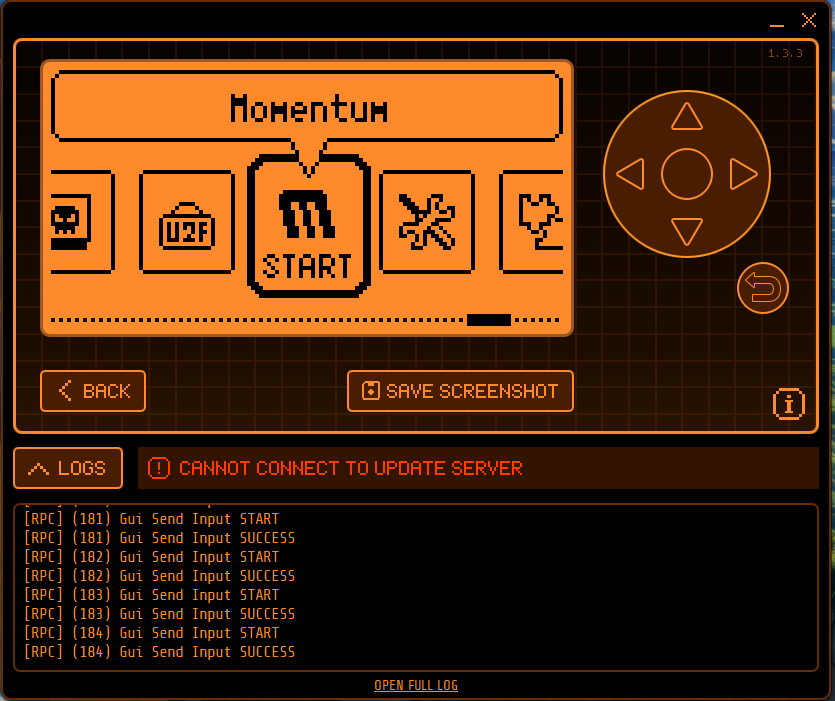
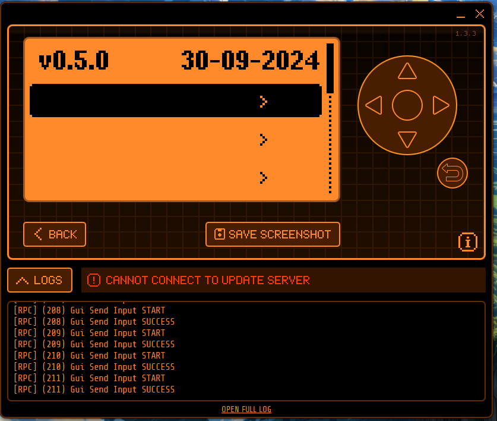
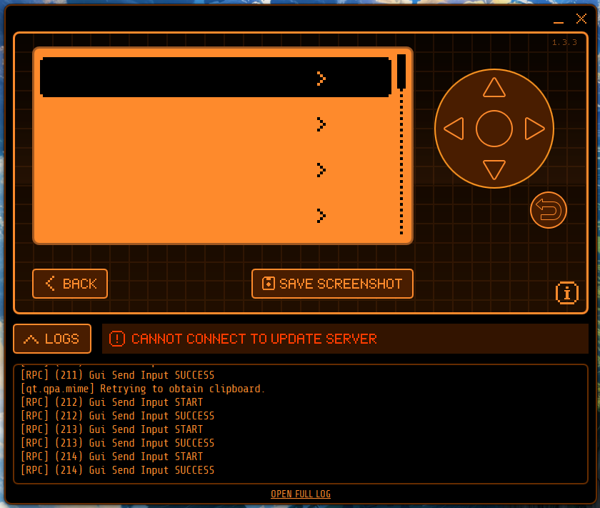
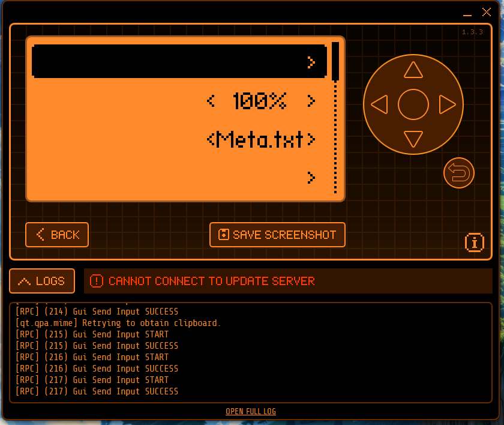
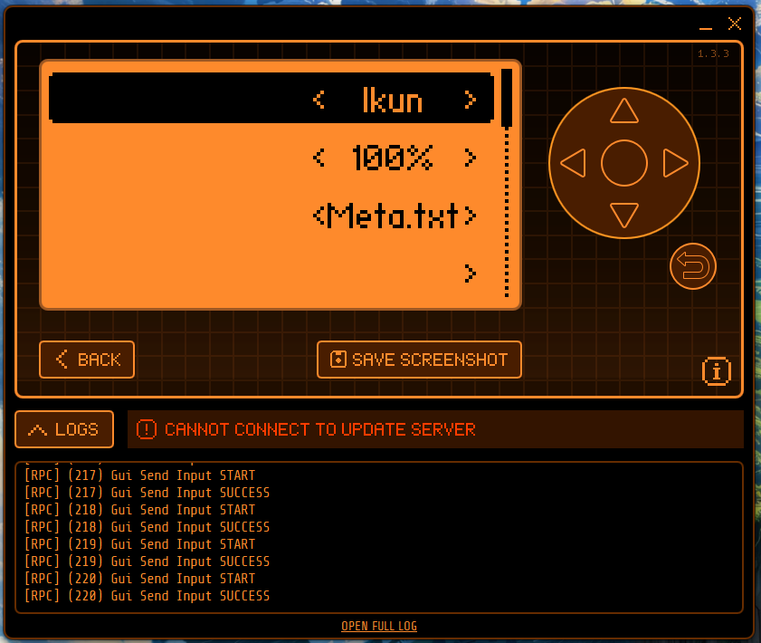
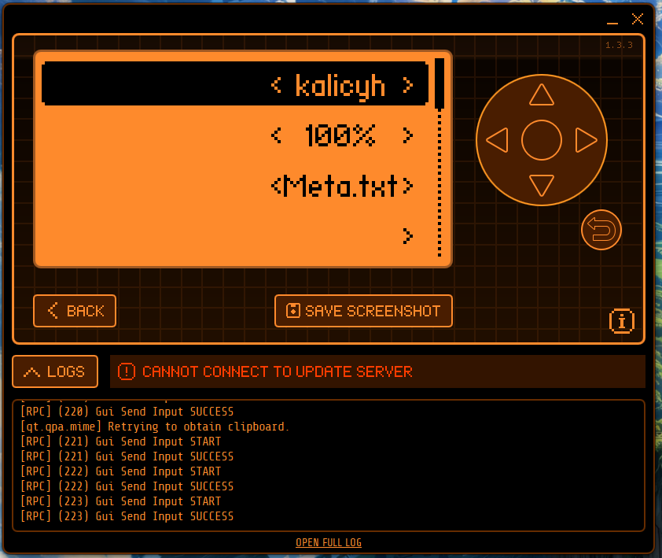
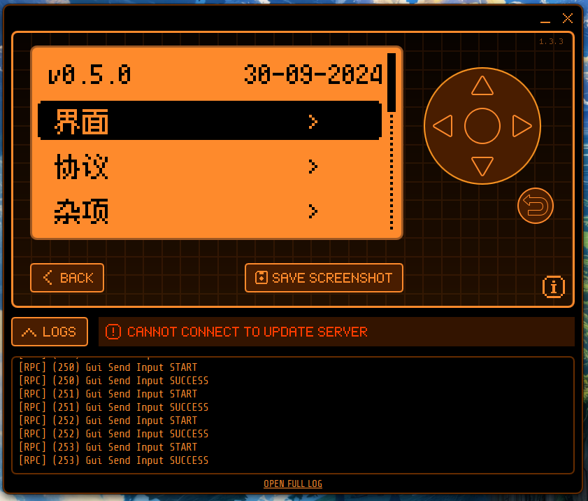

## 使用说明

#### 特别注意

需要手动切换资源包到`ikun`或者`kalicyh`

#### 参考以下步骤操作

###### 大概就是进入app后按三下ok然后右键切换最后返回

<table>
  <tr>
    <td></td>
    <td></td>
    <td></td>
  </tr>
  <tr>
    <td></td>
    <td></td>
    <td></td>
  </tr>
  <tr>
    <td></td>
    <td></td>
    <td></td>
  </tr>
</table>

使用`ikun`或者`kalicyh`的区别是
- `ikun`的桌面是ikun
- `kalicyh`的桌面是默认的小海豚

## 汉化方式

### 一、大部分内容汉化

#### （1）、生成字库数据

利用[u8g2_cn_tools](https://github.com/kalicyh/u8g2_cn_tools)

#### （2）、挂载字库

利用`assets\packs`进行资源包外挂

完美解决内存占用问题，并支持全中文

#### （3）、汉化

只需要将代码中的英文改成中文即可

### 二、部分特殊汉化

#### 设置内的APP列表

修改`Momentum-Firmware\applications\settings`目录内的`*.fam`的`name`字段

修改`scripts\fbt\elfmanifest.py`内的`self.name.encode("UTF-8")`

```PY
@dataclass
class ElfManifestV1:
    stack_size: int
    app_version: int
    name: str = ""
    icon: bytes = field(default=b"")

    def as_bytes(self):
        return struct.pack(
            "<hI32s?32s",
            self.stack_size,
            self.app_version,
            bytes(self.name.encode("UTF-8")),
            bool(self.icon),
            self.icon,
        )
```

## 正则表达式

```
"([^\u4e00-\u9fa5"]*)"
```

方便搜索未修改的内容

## 目前字库内容

中文需要放在符号之前，中文的符号需要放在ABCD之前

```
一万三上下不与丢个中为主义之乐习书了二于些交产亮仅介他代以仪件份仿休伙会伤伪位住何余作你佳使例供保信值倾停储儿允充先光入全公六关其具内册写军决冷准凑出击分切列删利别到制刻前剥剩剪力功加动助勿包化匹区匿十升协卓单卡却卸厂压原厨发取受变口只可右号吃同名后向否含听启呀告命和品哎商器回因围固图在地圾址坏块垃型域基堆填增声壳处备复外多大天失头夹夺好如始姓字存学安完定实家容密对将小少尝局屏展崩左差已布帮常幕干并序应度延建开异弃式引弹当录形彩影待很得循心必志忘忙快忽态怒性总恢息您情感愤憩成我或战房所扇手打执扩扫扰找投护报拔拟择持挂按损据捷掉接控描提插搜操擦收改攻放效数整文断新方无日旧时明星是显景暂暴更最有期未本机杂束来析果某柠查标栈栏栗样核格框桌档桥检棕榄槽模橄橙次止正此步段母每比气水永池汽没法波注泻洋洪活流测浏海消深添清溃源满激炸照片版牌牙特状率玩环现理生用电画界留略白的监盖盘目看真眠着睡知短码破硬确示禁离秒称移程空窗符等签管箭米类粉粘糕糟系索紧紫繁红级纵线绍经结绕绝统继续维绿缀编置群翻而耗耳背胜能脚自致般色节英苹范获菜蓝蔚藏虚虹行表被装要规视览角解警计认议记许设证试误请读调谢豚贴资超距跟跳踪车轰载较辑输边过运近返这进远连迟退送选透通速造道遥邮部配里重量针钟钥钮锁错键长闪闭问闲间阅阈限除陪随隐隔需震青静面音页项须频题颜额风饱验高黄黑默！，：？
```
